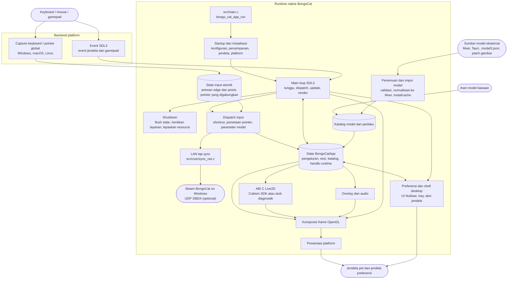

<div align="center">
  <a href="https://bongocat.pet" target="_blank">
    
  </a>

  <h1>
    <a href="https://bongocat.pet" target="_blank" style="text-decoration: none; color: inherit;">BongoCat</a>
  </h1>
</div>


<!-- Deskripsi Proyek + Ikon Roket -->
<p align="center">
 💘C/C++ × SDL3 × OpenGL, campur semuanya, satukan! Bong~ Bongo Cat!!!
</p>
<p align="center">
<a href="https://github.com/vladelaina/BongoCat/blob/main/README.md">English</a> • <a href="https://github.com/vladelaina/BongoCat/blob/main/docs/README.zh-CN.md">简体中文</a> • <a href="https://github.com/vladelaina/BongoCat/blob/main/docs/README.zh-Hant.md">繁體中文</a> • <a href="https://github.com/vladelaina/BongoCat/blob/main/docs/README.fr-FR.md">Français</a> • <a href="https://github.com/vladelaina/BongoCat/blob/main/docs/README.de-DE.md">Deutsch</a> • <a href="https://github.com/vladelaina/BongoCat/blob/main/docs/README.ja-JP.md">日本語</a> • <a href="https://github.com/vladelaina/BongoCat/blob/main/docs/README.ko-KR.md">한국어</a> • <a href="https://github.com/vladelaina/BongoCat/blob/main/docs/README.pt-BR.md">Português</a> • <a href="https://github.com/vladelaina/BongoCat/blob/main/docs/README.ru-RU.md">Русский</a> • <a href="https://github.com/vladelaina/BongoCat/blob/main/docs/README.es-ES.md">Español</a> • <strong>Bahasa Indonesia</strong>
</p>
<p align="center">
  <a href="https://github.com/vladelaina/BongoCat/blob/main/LICENSE"></a>
  <a href="https://github.com/vladelaina/BongoCat"></a>
  <a href="https://discord.gg/vf8jqnattk"></a>
  <a href="https://github.com/vladelaina/BongoCat/blob/main/docs/wechat.png"></a>
  <a href="https://qm.qq.com/q/cYlRBbvuda"></a>
</p>


<!-- Video Demo -->
<div align="center" style="margin-bottom: 30px;">
  <video src="https://github.com/user-attachments/assets/75719230-9e49-4124-ae5a-8e35592c5d49
" autoplay loop style="border-radius: 8px; max-width: 800px;"></video>
</div>


> [!TIP]
> Model yang ditampilkan dalam demo ini berasal dari [宇痕冫](https://space.bilibili.com/348616056).
>
> 🎁 Mencari model **gratis**? Kami bekerja sama dengan kreator model berbakat untuk menghadirkan beragam model gratis, sambil terus mengeksplorasi pengalaman desktop yang lebih seru! Kunjungi situs resmi kami: [bongocat.pet](https://bongocat.pet/models)


<p align="center">
  <a href="https://bongocat.pet/models">
    
  </a>
</p>

<p align="center">
    
  </p>

## 📥 Unduh

<a href="https://apps.microsoft.com/detail/9p41mlsx72xw?referrer=appbadge" target="_self" >
	
</a>

- GitHub Releases

  Unduh rilis terbaru dari [GitHub Releases](https://github.com/vladelaina/BongoCat/releases/latest).

## 🔁 Sinkronisasi LAN Steam (macOS → Windows)

Fork ini menambahkan jembatan LAN opsional yang mencerminkan penekanan tombol
dan klik mouse lokal ke komputer Windows yang menjalankan build BongoCat
**Steam**. Kucing Steam kemudian menepuk cakarnya dan mengumpulkan progres
PawPass / pencapaian dari input Mac Anda, tanpa mengetik karakter, merebut
fokus, atau memicu shortcut di sisi Windows.

### Apa yang disinkronkan

| Input lokal | Disinkronkan | Efek pada kucing Steam |
| --- | --- | --- |
| Tombol keyboard ditekan | Ya, sebagai tap generik | Tepukan cakar |
| Tombol kiri / kanan mouse ditekan | Ya, sebagai tap generik | Tepukan cakar |
| Pergerakan mouse | Tidak | Kucing Steam tetap mengikuti kursor Windows |
| Identitas tombol, posisi kursor | Tidak | Tidak direkonstruksi oleh penerima |

Protokolnya sengaja berbasis tap: satu datagram UDP `TAP:1` pada port `39824`
per penekanan. Penerima hanya perlu menambahkan tap ke penghitung input game,
sehingga kucing Steam berperilaku persis seperti tombol ditekan secara lokal.
Pengirim tidak bergantung pada renderer Live2D, sehingga berfungsi bahkan pada
build yang menggunakan backend diagnostik.

### Pengirim macOS (tertanam di aplikasi)

Pengirim berada di `src/core/sync_net.c` dan dikompilasi ke dalam aplikasi;
tidak diperlukan proses tambahan. Pengirim diaktifkan secara default dalam mode
siaran (`255.255.255.255:39824`). Target diresolusikan dalam urutan ini (yang
terakhir menang):

1. `sync.json` di direktori kerja
2. `~/Library/Application Support/BongoCat/config/sync.json`
3. Variabel lingkungan `BONGO_SYNC_IP` dan `BONGO_SYNC_PORT`
4. Argumen baris perintah `--sync-ip <address>`

`sync.json`:

```json
{
  "target_ip": "192.168.1.100",
  "target_port": 39824,
  "enabled": true
}
```

Menetapkan `target_ip` yang konkret mengalihkan pengirim dari siaran ke unicast
langsung, yang direkomendasikan saat jaringan memblokir siaran UDP. Kit
pendamping `tools/` menyertakan templat `sync.json.example`.

### Penerima Windows (build Steam)

Penerima disertakan dalam kit pendamping `tools/` yang menyertai fork ini.
Tersedia dua opsi:

- **Opsi A — patch dalam game (direkomendasikan).** `install_steam_patch.bat`
  menempatkan `BongoSync.dll` di `BongoCat_Data\Managed\` dan mengganti
  `Assembly-CSharp.dll` dengan build yang sudah dipatch, sehingga listener
  berjalan di dalam proses game dan tidak ada lagi yang perlu diluncurkan.
  `uninstall_steam_patch.bat` memulihkan file asli.
- **Opsi B — relay mandiri.** Jalankan `win_bongo_receiver.py` di Windows. Ini
  menyuntikkan virtual key non-karakter (`VK_NONAME`) yang sudah dipantau oleh
  build Steam, sehingga file game tidak tersentuh.

Kedua penerima mengikat UDP `39824`. Patch menyuntik ke
`BongoCat.OSSpecific.GlobalKeyHook`: `Awake` memulai listener, `Update`
mengalirkan tap yang diterima ke `_keysDown`, dan `OnApplicationQuit`
menghentikannya, sehingga tap mengalir melalui penanganan tap milik game itu
sendiri.

> **Catatan:** `BongoSync.dll` harus dikompilasi terhadap assembly terkelola
> game yang sudah di-strip. Lihat `README.md` kit pendamping untuk pemanggilan
> `mcs` yang tepat dan pemecahan masalah jaringan.

## 🛠️ Membangun dari Kode Sumber

BongoCat menggunakan CMake dan memerlukan compiler C11, compiler C++17, CMake 3.24
atau yang lebih baru, serta file pengembangan OpenGL desktop. SDL3, yyjson, stb,
miniaudio, dan Nuklear secara default diunduh saat proses konfigurasi, sehingga
konfigurasi pertama memerlukan akses jaringan.

Jalankan perintah berikut dari root proyek (direktori yang berisi
`CMakeLists.txt`).

### 📋 Prasyarat Platform

- **Windows:** Visual Studio 2022 dengan workload Desktop C++ dan CMake.
  Gunakan generator MSVC; MinGW dapat membangun backend diagnostik tetapi tidak
  didukung untuk Cubism SDK.
- **macOS:** Xcode Command Line Tools, CMake, dan Ninja. Pilih arsitektur dengan
  `CMAKE_OSX_ARCHITECTURES` jika berbeda dari default host.
- **Linux (Debian/Ubuntu):** GCC atau Clang, Ninja, serta header OpenGL/X11:

  ```bash
  sudo apt-get update
  sudo apt-get install -y build-essential cmake ninja-build \
    libgl1-mesa-dev libx11-dev libxi-dev libxfixes-dev
  ```

### 🔧 Konfigurasi dan Build

Di Linux dan macOS, gunakan generator single-configuration seperti Ninja:

```bash
cmake -S . -B build -G Ninja \
  -DCMAKE_BUILD_TYPE=Release \
  -DBONGO_CAT_FETCH_DEPS=ON
cmake --build build --parallel
```

Di Windows, jalankan dari shell developer Visual Studio 2022 (atau shell lain
yang menyediakan MSVC):

```powershell
cmake -S . -B build -G "Visual Studio 17 2022" -A x64 `
  -DBONGO_CAT_FETCH_DEPS=ON
cmake --build build --config Release --parallel
```

File executable dihasilkan di `build/BongoCat` pada Linux, di
`build/BongoCat.app/Contents/MacOS/BongoCat` di macOS, dan ke
`build/Release/BongoCat.exe` untuk build Visual Studio.

### 🧪 Pengujian

Target CTest diaktifkan secara default. Jalankan setelah proses build:

```bash
ctest --test-dir build --output-on-failure
```

Untuk generator multi-configuration seperti Visual Studio, pilih konfigurasi
build secara eksplisit:

```powershell
ctest --test-dir build -C Release --output-on-failure
```

### 🎭 Live2D / Cubism SDK (Opsional)

Jika Cubism SDK tidak tersedia, CMake akan menampilkan peringatan dan membangun
backend diagnostik. Backend ini ditujukan untuk diagnostik startup dan platform;
backend ini tidak menyediakan rendering model Live2D. Untuk membangun runtime
lengkap, pasang Cubism SDK for Native yang kompatibel lalu tempatkan di
`vendor/CubismSdkForNative` atau berikan lokasinya secara eksplisit:

```bash
cmake -S . -B build -G Ninja \
  -DCMAKE_BUILD_TYPE=Release \
  -DBONGO_CAT_CUBISM_SDK=/path/to/CubismSdkForNative \
  -DBONGO_CAT_REQUIRE_CUBISM=ON
```

SDK harus berisi Core library, source Framework, dan tree third-party OpenGL GLEW
dengan tata letak yang diharapkan oleh `cmake/Cubism.cmake`. Build Cubism di
Windows memerlukan Visual Studio 2022. `BONGO_CAT_REQUIRE_CUBISM=ON` membuat
konfigurasi gagal alih-alih diam-diam memilih backend diagnostik.

### ⚙️ Opsi CMake

| Opsi | Default | Deskripsi |
| --- | --- | --- |
| `BONGO_CAT_FETCH_DEPS` | `ON` | Unduh dependency pihak ketiga yang versinya dipin menggunakan CMake `FetchContent`. Atur ke `OFF` hanya jika SDL3, yyjson, stb, miniaudio, dan Nuklear sudah tersedia untuk CMake. |
| `BONGO_CAT_CUBISM_SDK` | `vendor/CubismSdkForNative` | Path ke Cubism SDK for Native. |
| `BONGO_CAT_REQUIRE_CUBISM` | `OFF` | Gagalkan konfigurasi jika Cubism SDK yang dapat digunakan tidak tersedia. |
| `BONGO_CAT_WARNINGS_AS_ERRORS` | `OFF` | Perlakukan warning compiler native sebagai error. |

Untuk build offline dengan `BONGO_CAT_FETCH_DEPS=OFF`, sediakan konfigurasi
package CMake untuk SDL3 (termasuk `SDL3-static`) dan yyjson, serta direktori
include untuk stb, Nuklear, dan miniaudio jika tidak dapat ditemukan secara
otomatis:

```bash
cmake -S . -B build -G Ninja \
  -DCMAKE_BUILD_TYPE=Release \
  -DBONGO_CAT_FETCH_DEPS=OFF \
  -DBONGO_CAT_STB_INCLUDE_DIR=/path/to/stb \
  -DBONGO_CAT_NUKLEAR_INCLUDE_DIR=/path/to/nuklear \
  -DBONGO_CAT_MINIAUDIO_INCLUDE_DIR=/path/to/miniaudio
```

## 📌 Status Proyek


## 📜 Lisensi

Kode sumber dan runtime native BongoCat dilisensikan di bawah
[AGPL-3.0-only](../LICENSE).

Mode model bawaan default (`standard`) tetap berlisensi MIT. Aset model yang
disertakan dalam `resources/assets/models/standard`, `keyboard`, dan `gamepad`
dilindungi oleh [pemberitahuan lisensi MIT](../LICENSE-MIT) terpisah.
Lisensi MIT tersebut hanya berlaku untuk aset model dan artwork pendampingnya;
lisensi tersebut tidak mengubah lisensi kode sumber atau runtime native BongoCat.


## 🧭 Arsitektur Teknis

> Versi native saat ini dibangun dengan C/C++, SDL3, dan OpenGL. Diagram di bawah berfokus pada aliran data runtime; detail build dan packaging berada di CMake.

### 🔄 Kepemilikan Runtime dan Penjadwalan Frame

Setiap proses memiliki satu `BongoCatApp` serta satu event loop dan render loop
di thread utama. Listener platform berhenti pada batas input:

```text
Listener platform
(keyboard / pointer)
            |
            v
  state input C11
  (antrean edge atomik + posisi pointer yang digabungkan)
            |
            v
  aplikasi thread utama <----- event SDL3
            |
            v
  parameter model, overlay, dan state UI
            |
            v
  update model -> komposisi OpenGL -> presentasi platform
```

Penerima Raw Input Windows, event tap Quartz macOS, dan listener XInput2 Linux
berjalan di luar main loop. Perubahan tombol masuk ke antrean atomik berbatas,
gerakan digabungkan secara terpisah, dan event SDL membangunkan thread utama.
Windows memakai jendela khusus pesan dengan `RIDEV_INPUTSINK | RIDEV_DEVNOTIFY`
untuk menerima input latar belakang sambil mempertahankan pesan jendela biasa.
Model memakai gerakan perangkat ketika aplikasi lain menyembunyikan atau mengunci
kursor; SDL menyediakan posisi kursor desktop. Status tombol dibersihkan ketika
perangkat dilepas atau desktop input berganti. Windows tidak lagi memakai hook
input atau DirectInput. Event jendela SDL3, preferensi, dan gamepad ditangani di thread utama,
tempat event gamepad dinormalisasi sebelum mencapai parameter model atau
shortcut. Tidak ada listener platform yang memanggil kode Live2D, overlay, atau
UI secara langsung.

Dispatch input juga memberi umpan ke sinkronisasi tap LAN opsional
(`src/core/sync_net.c`). Ini independen dari jalur Live2D dan overlay serta
mengirim satu datagram UDP `TAP:1` pada setiap key-down dan mouse-button-down;
gerakan mouse tidak diteruskan. Sinkronisasi tidak melakukan apa-apa saat
dinonaktifkan dan tidak pernah memblokir main loop karena socket-nya
non-blocking.

`bongo_cat_app_run` menangani update-shutdown dan argumen proses sekunder,
memastikan kepemilikan single-instance untuk proses utama, mengalokasikan state
aplikasi, menjalankan inisialisasi, masuk ke `bongo_cat_app_loop`, lalu melakukan
flush state dan menghancurkan resource dalam urutan yang terdefinisi.
Inisialisasi memuat konfigurasi dan path penyimpanan, menemukan aset, membuat
jendela pet SDL/OpenGL, menginisialisasi backend platform, membuat layanan
Live2D, overlay, dan audio, memindai sumber model bawaan/terpasang/terdekat, lalu
memuat model yang dapat digunakan. `BongoCatApp` memiliki pengaturan, state
sesi, katalog model dan perilaku, handle platform, serta handle layanan runtime.

Paket model yang terpasang menggunakan Mver sebagai format kanonis. Workflow
impor menentukan file atau direktori yang dipilih, menemukan dan memvalidasi
kandidat, membuat fingerprint identitas paket, mengonversi sumber Tauri ke Mver,
menerapkan patch gambar, lalu menyimpan paket yang sudah dinormalisasi di bawah
`models_root`. Setelah itu, workflow menghasilkan adapter runtime dan
memperbarui katalog. Sumber terdekat ditemukan tanpa memasang source tree-nya;
adapter dan hasil inspeksinya di-cache di luar `models_root` di bawah
`cache_root`.

Setiap iterasi main loop menunggu sinyal wakeup SDL/native atau deadline frame, UI,
animasi, atau pointer-hit terdekat yang masih tertunda (dengan waktu tunggu
maksimum 250 ms). Iterasi tersebut mendispatch event SDL yang mengantre,
menguras antrean input atomik dan release recovery, memperbarui state jendela
dan model-refresh, serta menerapkan parameter yang berasal dari input. Saat
Cubism aktif, deadline model mengikuti `settings.model.max_fps` (default 60 FPS);
build diagnostik menggunakan interval fallback 100 ms. Waktu model yang berlalu
dibatasi hingga 250 ms dan dibagi menjadi maksimal delapan substep, dengan
target tidak lebih dari 1/30 detik per substep.

Jalur render pet normal hanya melakukan render saat jendela terlihat, tidak diminimalkan,
dan ditandai dirty. Sebuah frame membersihkan latar belakang, menggambar model, dan
mengomposisikan overlay pointer, tombol, dan efek sebelum memanggil presenter
platform. Operasi preview dapat meminta render langsung, sedangkan render
capture dapat melewati presentasi. macOS dan Linux menukar jendela SDL OpenGL
secara langsung. Windows melakukan swap langsung saat layered presentation tidak
aktif; jika aktif, Windows membaca kembali frame untuk `UpdateLayeredWindow`.
UI preferensi memiliki jendela SDL/OpenGL terpisah yang dirender dan
dipresentasikan secara independen dari jendela pet.

Runtime C memanggil ABI yang dideklarasikan di `include/bongo_cat/model.h`.
Bridge Live2D dan implementasi Cubism berada di `src/live2d` dan hanya
menggunakan C++17 saat Cubism SDK diaktifkan; runtime native lainnya menggunakan
C11. Tipe Cubism tetap berada di balik handle C yang opaque, sedangkan
`src/live2d/live2d_stub.c` menyediakan backend diagnostik ketika SDK tidak
tersedia.




## ❓ FAQ

### 🔒 Apakah BongoCat merekam input keyboard atau mouse saya?

Tidak. BongoCat memproses input keyboard dan mouse secara lokal untuk
menggerakkan animasi dan shortcut. BongoCat tidak merekam atau mengunggah
keystroke, aksi mouse, atau data interaksi lainnya. Konfigurasi juga disimpan
secara lokal, dan aplikasi tidak memiliki iklan, alat analitik, atau kode
pelacakan pengguna. Saat pemeriksaan pembaruan dilakukan, aplikasi hanya meminta
metadata rilis publik; aplikasi tidak mengirim data input, konfigurasi, atau
penggunaan.

### 🖼️ Mengapa OpenGL, bukan Vulkan?

Kami memilih OpenGL bukan karena Vulkan buruk, tetapi karena BongoCat tidak
memerlukan tingkat kompleksitas tersebut. Aplikasi terutama merender satu model
Live2D, beberapa lapisan UI, dan sebuah jendela desktop transparan. OpenGL sudah
menangani kebutuhan tersebut dengan nyaman dan bekerja secara alami dengan SDL3
serta renderer OpenGL milik Cubism. Beralih ke Vulkan berarti harus memelihara
lebih banyak kode rendering dan sinkronisasi di tiga platform desktop, tanpa
peningkatan yang terasa bagi pengguna. Untuk beban kerja BongoCat saat ini, OpenGL
menjaga renderer tetap lebih kecil, lebih mudah di-debug, dan lebih mudah
dipelihara sambil tetap memberikan performa yang dibutuhkan.


## Status Proyek


## 🙏 Ucapan Terima Kasih
> [!TIP]
> Setiap langkah BongoCat digerakkan oleh semangat open source. Kami dengan tulus berterima kasih kepada seluruh kontributor komunitas atas kontribusi mereka tanpa pamrih (tercantum di bawah berdasarkan urutan tanggal kontribusi). Dukungan Anda membuat pengalaman pendamping desktop menjadi lebih bebas dan autentik.❤️‍🔥


<a href="https://bongocat.pet">
    
</a>


[linux.do](https://linux.do/t/topic/2845597)
---

<div align="center">

Copyright © 2026 - **BongoCat**\
Oleh vladelaina\
Dibuat dengan ❤️ & ⌨️

</div>
