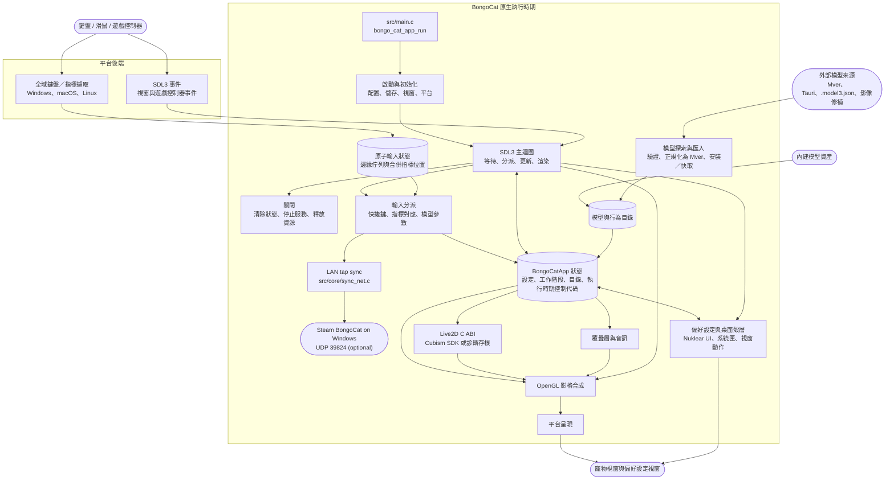

<div align="center">
  <a href="https://bongocat.pet" target="_blank">
    
  </a>
  
  <h1>
    <a href="https://bongocat.pet" target="_blank" style="text-decoration: none; color: inherit;">BongoCat</a>
  </h1>
</div>


<!-- 專案描述 + 火箭圖示 -->
<p align="center"> 
 💘C/C++ × SDL3 × OpenGL，攪拌均勻，搗碎融合！Bong~ Bongo Cat！！！ 
</p>
<p align="center">
<a href="https://github.com/vladelaina/BongoCat/blob/main/README.md"><strong>English</strong></a> • <a href="https://github.com/vladelaina/BongoCat/blob/main/docs/README.zh-CN.md">简体中文</a> • <a href="https://github.com/vladelaina/BongoCat/blob/main/docs/README.zh-Hant.md">繁體中文</a> • <a href="https://github.com/vladelaina/BongoCat/blob/main/docs/README.fr-FR.md">Français</a> • <a href="https://github.com/vladelaina/BongoCat/blob/main/docs/README.de-DE.md">Deutsch</a> • <a href="https://github.com/vladelaina/BongoCat/blob/main/docs/README.ja-JP.md">日本語</a> • <a href="https://github.com/vladelaina/BongoCat/blob/main/docs/README.ko-KR.md">한국어</a> • <a href="https://github.com/vladelaina/BongoCat/blob/main/docs/README.pt-BR.md">Português</a> • <a href="https://github.com/vladelaina/BongoCat/blob/main/docs/README.ru-RU.md">Русский</a> • <a href="https://github.com/vladelaina/BongoCat/blob/main/docs/README.es-ES.md">Español</a> • <a href="https://github.com/vladelaina/BongoCat/blob/main/docs/README.id-ID.md">Bahasa Indonesia</a>
</p>
<p align="center">
  <a href="https://github.com/vladelaina/BongoCat/blob/main/LICENSE"></a>
  <a href="https://github.com/vladelaina/BongoCat"></a>
  <a href="https://discord.gg/vf8jqnattk"></a>
  <a href="https://github.com/vladelaina/BongoCat/blob/main/docs/wechat.png"></a>
  <a href="https://qm.qq.com/q/cYlRBbvuda"></a>
</p>


<!-- 示範影片 -->
<div align="center" style="margin-bottom: 30px;">
  <video src="https://github.com/user-attachments/assets/75719230-9e49-4124-ae5a-8e35592c5d49
" autoplay loop style="border-radius: 8px; max-width: 800px;"></video>
</div>


> [!TIP]
> 本示範所使用的模型來自 [宇痕冫](https://space.bilibili.com/348616056)。
>
> 🎁 尋找**免費**模型？我們與才華洋溢的模型創作者合作，為您帶來豐富多樣的免費模型，同時持續探索更多有趣的桌面體驗！請瀏覽我們的官方網站：[bongocat.pet](https://bongocat.pet/models)


<p align="center">
  <a href="https://bongocat.pet/models">
    
  </a>
</p>

<p align="center">
    
  </p>

## 📥 下載

<a href="https://apps.microsoft.com/detail/9p41mlsx72xw?referrer=appbadge" target="_self" >
	
</a>

- GitHub Releases

  從 [GitHub Releases](https://github.com/vladelaina/BongoCat/releases/latest) 下載最新版本。

## 🔁 Steam 區域網路同步（macOS → Windows）

此分支新增了一個可選的區域網路橋接功能，可將本地的按鍵和滑鼠點擊鏡像到執行 BongoCat **Steam** 版本的 Windows 機器上。接著 Steam 小貓會揮爪，並根據你的 Mac 輸入累積 PawPass / 成就進度，而不會在 Windows 端輸入字元、搶佔焦點或觸發快速鍵。

### 同步的內容

| 本地輸入 | 是否同步 | 對 Steam 小貓的影響 |
| --- | --- | --- |
| 鍵盤按鍵按下 | 是，作為通用輕觸 | 揮爪 |
| 滑鼠左鍵 / 右鍵按下 | 是，作為通用輕觸 | 揮爪 |
| 滑鼠移動 | 否 | Steam 小貓繼續跟隨 Windows 游標 |
| 按鍵身分、游標位置 | 否 | 接收端不會重建 |

此協定刻意採用基於輕觸的設計：每次按下傳送一個連接埠 `39824` 上的 `TAP:1` UDP 資料包。接收端只需向遊戲的輸入計數器加入一次輕觸，因此 Steam 小貓的行為與本地按鍵完全一致。傳送端獨立於 Live2D 渲染器，因此即使在使用診斷後端的建置中也能正常運作。

### macOS 傳送端（內建於應用程式）

傳送端位於 `src/core/sync_net.c`，並編譯進應用程式；不需要額外的行程。它預設以廣播模式（`255.255.255.255:39824`）啟用。目標的解析順序如下（後者優先）：

1. 工作目錄中的 `sync.json`
2. `~/Library/Application Support/BongoCat/config/sync.json`
3. `BONGO_SYNC_IP` 和 `BONGO_SYNC_PORT` 環境變數
4. `--sync-ip <address>` 命令列參數

`sync.json`：

```json
{
  "target_ip": "192.168.1.100",
  "target_port": 39824,
  "enabled": true
}
```

設定具體的 `target_ip` 會將傳送端從廣播切換為直接單播，當網路封鎖 UDP 廣播時建議這樣做。隨附的 `tools/` 工具組附帶一個 `sync.json.example` 範本。

### Windows 接收端（Steam 版本）

接收端隨本分支隨附的 `tools/` 工具組提供。有兩種選擇：

- **選項 A —— 遊戲內修補（推薦）。** `install_steam_patch.bat` 會將 `BongoSync.dll` 放入 `BongoCat_Data\Managed\`，並以修補過的建置取代 `Assembly-CSharp.dll`，因此監聽器在遊戲行程內執行，無需啟動其他程式。`uninstall_steam_patch.bat` 會還原原始檔案。
- **選項 B —— 獨立中繼。** 在 Windows 上執行 `win_bongo_receiver.py`。它會注入一個 Steam 版本已在監看的非字元虛擬鍵（`VK_NONAME`），不會更動遊戲檔案。

兩種接收端都綁定 UDP `39824`。修補會注入到 `BongoCat.OSSpecific.GlobalKeyHook`：`Awake` 啟動監聽器，`Update` 將接收到的輕觸排入 `_keysDown`，`OnApplicationQuit` 停止它，因此輕觸會流經遊戲自身的輕觸處理邏輯。

> **注意：** `BongoSync.dll` 必須針對遊戲剝離後的受控組件進行編譯。有關確切的 `mcs` 呼叫方式和網路疑難排解，請參閱隨附工具組的 `README.md`。

## 🛠️ 從原始碼建置

BongoCat 使用 CMake，需要 C11 編譯器、C++17 編譯器、CMake 3.24 或更新版本，以及桌面 OpenGL 開發檔案。SDL3、yyjson、stb、miniaudio 和 Nuklear 預設在建置配置時下載，因此首次配置需要網路連線。

請在專案根目錄（包含 `CMakeLists.txt` 的目錄）執行以下命令。

### 📋 平台先決條件

- **Windows：** Visual Studio 2022 並包含「桌面 C++」工作負載和 CMake。請使用 MSVC 產生器；MinGW 可建置診斷後端，但不支援 Cubism SDK。
- **macOS：** Xcode Command Line Tools、CMake 和 Ninja。若目標架構與主機預設不同，請以 `CMAKE_OSX_ARCHITECTURES` 指定。
- **Linux（Debian/Ubuntu）：** GCC 或 Clang、Ninja，以及 OpenGL/X11 標頭檔：

  ```bash
  sudo apt-get update
  sudo apt-get install -y build-essential cmake ninja-build \
    libgl1-mesa-dev libx11-dev libxi-dev libxfixes-dev libcurl4-openssl-dev
  ```

### 🔧 配置與建置

在 Linux 和 macOS 上，使用單一配置產生器（如 Ninja）：

```bash
cmake -S . -B build -G Ninja \
  -DCMAKE_BUILD_TYPE=Release \
  -DBONGO_CAT_FETCH_DEPS=ON
cmake --build build --parallel
```

在 Windows 上，請從 Visual Studio 2022 開發人員命令提示字元（或任何可使用 MSVC 的 Shell）執行：

```powershell
cmake -S . -B build -G "Visual Studio 17 2022" -A x64 `
  -DBONGO_CAT_FETCH_DEPS=ON
cmake --build build --config Release --parallel
```

執行檔產出位置：
- Linux：`build/BongoCat`
- macOS：`build/BongoCat.app/Contents/MacOS/BongoCat`
- Visual Studio 建置：`build/Release/BongoCat.exe`

### 🧪 測試

CTest 目標預設啟用。建置完成後執行：

```bash
ctest --test-dir build --output-on-failure
```

若使用多配置產生器（如 Visual Studio），請明確指定建置配置：

```powershell
ctest --test-dir build -C Release --output-on-failure
```

### 🎭 Live2D / Cubism SDK（選用）

若未提供 Cubism SDK，CMake 會發出警告並建置診斷後端。此後端僅供啟動和平台診斷之用，不提供 Live2D 模型渲染。若要建置完整執行時期，請安裝相容的 Cubism SDK for Native，並將其放置在 `vendor/CubismSdkForNative`，或明確傳遞路徑：

```bash
cmake -S . -B build -G Ninja \
  -DCMAKE_BUILD_TYPE=Release \
  -DBONGO_CAT_CUBISM_SDK=/path/to/CubismSdkForNative \
  -DBONGO_CAT_REQUIRE_CUBISM=ON
```

SDK 必須包含 Core 函式庫、Framework 原始碼，以及 `cmake/Cubism.cmake` 所預期的 OpenGL GLEW 第三方目錄結構。Windows 上的 Cubism 建置需要 Visual Studio 2022。設定 `BONGO_CAT_REQUIRE_CUBISM=ON` 會在無法使用 Cubism SDK 時使配置失敗，而非靜默改用診斷後端。

### ⚙️ CMake 選項

| 選項 | 預設值 | 說明 |
| --- | --- | --- |
| `BONGO_CAT_FETCH_DEPS` | `ON` | 使用 CMake `FetchContent` 下載固定的第三方依賴項。僅在 SDL3、yyjson、stb、miniaudio 和 Nuklear 已可被 CMake 找到時設為 `OFF`。 |
| `BONGO_CAT_CUBISM_SDK` | `vendor/CubismSdkForNative` | Cubism SDK for Native 的路徑。 |
| `BONGO_CAT_REQUIRE_CUBISM` | `OFF` | 當無法使用 Cubism SDK 時使配置失敗。 |
| `BONGO_CAT_WARNINGS_AS_ERRORS` | `OFF` | 將原生編譯器警告視為錯誤。 |

若要進行離線建置，設定 `BONGO_CAT_FETCH_DEPS=OFF`，並提供 SDL3（含 `SDL3-static`）和 yyjson 的 CMake 套件配置，以及 stb、Nuklear、miniaudio 的包含路徑（若無法自動找到）：

```bash
cmake -S . -B build -G Ninja \
  -DCMAKE_BUILD_TYPE=Release \
  -DBONGO_CAT_FETCH_DEPS=OFF \
  -DBONGO_CAT_STB_INCLUDE_DIR=/path/to/stb \
  -DBONGO_CAT_NUKLEAR_INCLUDE_DIR=/path/to/nuklear \
  -DBONGO_CAT_MINIAUDIO_INCLUDE_DIR=/path/to/miniaudio
```

## 📌 專案狀態


## 📜 授權條款

BongoCat 原始碼和原生執行時期採用 [AGPL-3.0-only](LICENSE) 授權。

預設內建模型模式（`standard`）仍以 MIT 授權釋出。`resources/assets/models/standard`、`keyboard` 和 `gamepad` 中的模型資產，則受個別的 [MIT 授權聲明](LICENSE-MIT) 規範。該 MIT 授權僅適用於模型資產及其附屬藝術作品，不適用於 BongoCat 原始碼或原生執行時期。


## 🧭 技術架構

> 目前原生版本基於 C/C++、SDL3 和 OpenGL 建構。下圖著重於執行時期資料流；建置與打包細節請參閱 CMake。

### 🔄 執行時期所有權與影格排程

每個行程擁有一個 `BongoCatApp` 和一個主執行緒事件與渲染迴圈。平台監聽器僅作用於輸入邊界：

```text
平台監聽器
（鍵盤／指標）
            |
            v
  C11 輸入狀態
（原子邊緣佇列 + 合併指標位置）
            |
            v
  主執行緒應用程式 <----- SDL3 事件
            |
            v
  模型參數、覆疊層與 UI 狀態
            |
            v
  模型更新 -> OpenGL 合成 -> 平台呈現
```

Windows Raw Input 接收器、macOS Quartz 事件監聽，以及 Linux XInput2 監聽器均執行於主迴圈之外。按鍵和滑鼠按鈕邊緣事件進入有界原子佇列，移動量獨立合併，並透過 SDL 事件喚醒主執行緒。Windows 使用訊息專用視窗，以 `RIDEV_INPUTSINK | RIDEV_DEVNOTIFY` 訂閱背景鍵鼠輸入並保留一般視窗訊息；其他程式隱藏或鎖定游標時，模型使用裝置回報的移動量，桌面跟隨則讀取 SDL 提供的系統游標位置。裝置拔除或輸入桌面切換時會清理按下狀態。Windows 不再安裝輸入鉤子或使用 DirectInput，也不向遊戲傳送輸入。SDL3 視窗、偏好設定和遊戲控制器事件仍在主執行緒處理，平台監聽器不會直接呼叫 Live2D、覆疊層或 UI 程式碼。

輸入分派也會供給一個可選的區域網路輕觸同步器（`src/core/sync_net.c`）。它獨立於 Live2D 和覆疊層路徑，並在每次按鍵按下和滑鼠按鈕按下時傳送一個 `TAP:1` UDP 資料包；滑鼠移動不會被轉送。同步器在停用時為空操作，且由於其通訊端為非阻塞，絕不會阻塞主迴圈。

`bongo_cat_app_run` 負責處理更新、關閉和輔助行程參數，為主要行程強制執行單一實例所有權，分配應用程式狀態，執行初始化，進入 `bongo_cat_app_loop`，然後依序清除狀態並釋放資源。初始化會載入配置和儲存路徑、定位資產、建立 SDL/OpenGL 寵物視窗、初始化平台後端、建立 Live2D、覆疊層和音訊服務、掃描內建／已安裝／鄰近模型來源，並載入可用的模型。`BongoCatApp` 擁有設定、工作階段狀態、模型與行為目錄、平台控制代碼，以及執行時期服務控制代碼。

已安裝的模型套件使用 Mver 作為標準格式。匯入流程會解析選取的檔案或目錄、探索並驗證候選項目、指紋辨識套件識別、將 Tauri 來源轉換為 Mver、套用影像修補，並將標準化套件提交至 `models_root`，接著產生執行時期轉接器並重新整理目錄。鄰近來源則在不安裝其原始碼樹的情況下被探索；其轉接器和檢查結果會快取在 `models_root` 之外的 `cache_root` 下。

每次主迴圈迭代會等待 SDL／原生喚醒事件，或最早待處理的影格、UI、動畫或指標點擊期限（最長等待 250 毫秒）。它會分派佇列中的 SDL 事件、清空原子輸入佇列與釋放復原、更新視窗與模型重新整理狀態，並套用輸入衍生參數。啟用 Cubism 時，模型期限遵循 `settings.model.max_fps`（預設 60 FPS）；診斷版本則使用 100 毫秒的備用間隔。模型經過時間上限為 250 毫秒，並分割為最多八個子步驟，每個子步驟不超過 1/30 秒。

一般寵物路徑僅在視窗可見、未最小化且標記為髒污時才進行渲染。每個影格會清除背景、繪製模型，並合成指標、按鍵與特效覆疊層，最後呼叫平台呈現器。預覽操作可要求立即渲染，而擷取渲染則可能略過呈現。macOS 和 Linux 直接交換 SDL OpenGL 視窗。Windows 在圖層呈現未啟用時直接交換，否則會讀回影格供 `UpdateLayeredWindow` 使用。偏好設定 UI 擁有獨立的 SDL/OpenGL 視窗，且獨立於寵物視窗進行渲染和呈現。

C 執行時期會呼叫 `include/bongo_cat/model.h` 中宣告的 ABI。Live2D 橋接與 Cubism 實作位於 `src/live2d`，且僅在啟用 Cubism SDK 時使用 C++17；其餘原生執行時期則使用 C11。Cubism 類型保留在不透明的 C 控制代碼之後，而 `src/live2d/live2d_stub.c` 則在 SDK 不可用時提供診斷後端。




## ❓ 常見問答

### 🔒 BongoCat 會記錄我的鍵盤或滑鼠輸入嗎？

不會。BongoCat 僅在本地處理鍵盤和滑鼠輸入，以驅動動畫和快捷鍵。它不會記錄或上傳您的按鍵、滑鼠動作或其他互動資料。配置也僅儲存在本地，且應用程式不含廣告、分析工具或使用者追蹤程式碼。執行更新檢查時，僅會請求公開的發行版本元資料；不會傳送輸入、配置或使用資料。

### 🖼️ 為什麼選擇 OpenGL 而非 Vulkan？

我們選擇 OpenGL 並非因為 Vulkan 不好，而是 BongoCat 不需要那樣的複雜度。本應用主要渲染一個 Live2D 模型、少數 UI 層，以及一個透明桌面視窗。OpenGL 已能輕鬆應付，且與 SDL3 和 Cubism 的 OpenGL 渲染器自然整合。轉向 Vulkan 意味著要在三個桌面平台上維護更多渲染和同步程式碼，但對使用者而言並不會有明顯改善。就 BongoCat 目前的工作負載而言，OpenGL 讓渲染器更小巧、更容易除錯和維護，同時仍能提供我們所需的效能。


## 專案狀態


## 🙏 特別感謝
> [!TIP]
> BongoCat 的每一步都得益於開源精神。我們衷心感謝所有社群貢獻者的無私奉獻（按貢獻日期先後排序列於下方）。正是你們的支持，讓桌面陪伴更加自由與真誠。❤️‍🔥


<a href="https://bongocat.pet">
    
</a>


[linux.do](https://linux.do/t/topic/2845597)
---

<div align="center">

Copyright © 2026 - **BongoCat**\
由 vladelaina 製作\
以 ❤️ 和 ⌨️ 打造

</div>
